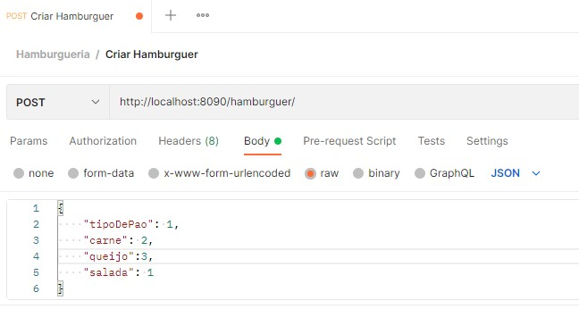
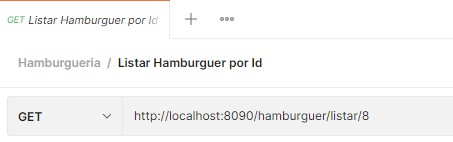
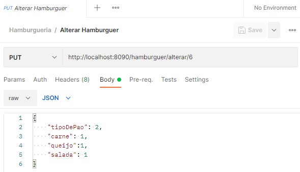
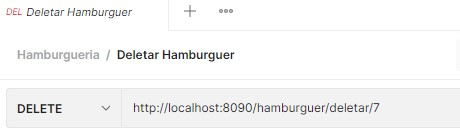
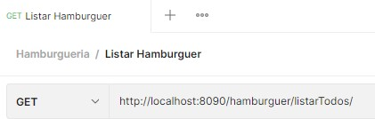
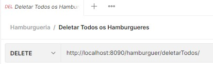

# API REST - :hamburger: SANTA HAMBURGUERIA-v2 :hamburger:

Santa Hamburgueria é o projeto de uma api que tem como objetivo mostrar todas as tecnologias que
tenho estudado e trabalhado recentemente. Nesta segunda versão alterei a arquitetura de MVC para
Clean Architecture conhecimhento adquirido com o projeto que estava atuando no trabalho e a leitura do livro
**Clean Architecture de Robert Cecil Martin**, onde o foco é isolar o domínio da aplicação, resultando no seguintes benefícios:

 - Independência de frameworks
 - Testabilidade
 - Independência da UI
 - Independêndia de banco de dados
 - Indepêndencia de qualquer agência externa

O livro tem uma parte muito interessante também sobre Princípios de Design
 
 **S**RP - O princípio da responsabilidade única\
 **O**CP - O princípio Aberto/Fechado\
 **L**SP - O princípio de Substituiçao de Liskov\
 **I**SP - O princípio da Segregação de Interface\
 **D**IP - O princípio da Inversão de dependência\
 

Além de falar sobre Paradigmas da Programação (Estruturada, Orientada a objetos e Funcional), componentes, arquitetura ...

A versão também conta com contêineres Docker 

## Sobre o projeto

## Api permite que você:
|Função                                 |        Rota local                               |
|---------------------------------------|-------------------------------------------------|
| crie um hambúrguer                    |  http://localhost:8090/hamburguer/              |
| liste todos os hambúrgueres criados   |  http://localhost:8090/hamburguer/listaTodos/   |
| buscar Hamburguer Por Id              |  http://localhost:8090/hamburguer/listar/{id}   |
| alterar um hambúrguer Por Id          |  http://localhost:8090/hamburguer/alterar/{id}  |
| deletar um hambúrguer Por Id          |  http://localhost:8090/hamburguer/deletar/{id}  |
| deletar todos os hambúrgueres criados |  http://localhost:8090/hamburguer/deletarTodos/ |

## Tecnologias Utilizadas

 - Kotlin
 - SpringBoot
 - PostgreSql
 - Gradle
 - Docker

## Modelo Arquiterura

 - Clean Architecture

## Como testar

### POST

### GET/{id}

### PUT/{id}

### DELETE/{id}

### GET

### DELETE
